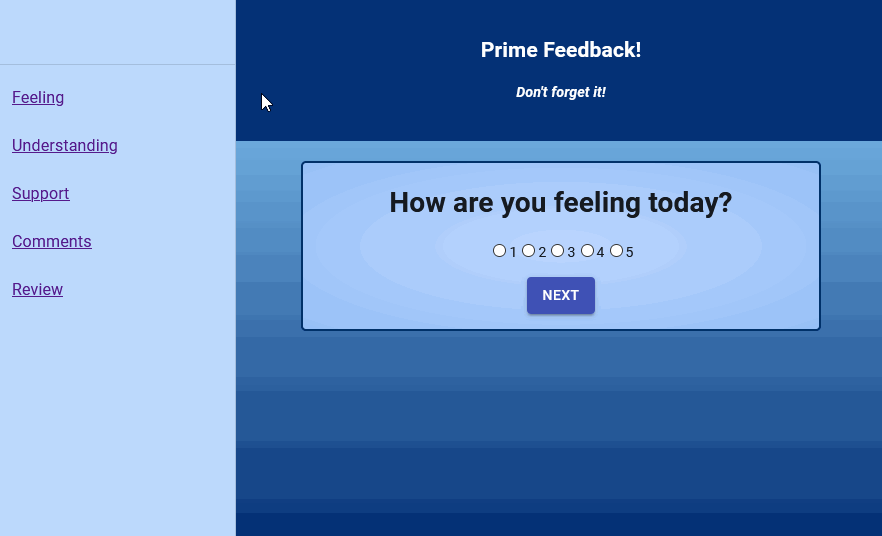

# REDUX FEEDBACK LOOP

## Description

_Duration: 2 Days_

This application allows the user to submit responses to 4 questions to a database.

## Example GIF

## Setup

1. Run the query from the database.sql file to create a new table in the SQL database of your choice, values are included if you want to use the images included with the project.
2. Use the "$ npm install" command to install dependencies.
3. Use the "$ npm run server" command to start the server. 
4. Use the "$ npm run client" command to start the react development build. 
5. Access the webpage via the url "localhost:3000"

## Usage

1. Read each question and select the number that corresponds to the answer. Press the "NEXT" button after you have selected a response
2. The review page allows you to see all answers that have been submitted. You may use the back buttons or the links on the left side of the page to change any answers before sending the answers to the database
3. Once you are satisfied with your answers, press "SUBMIT" on the review page to send the answers to the database.
4. You may submit additional answers if desired.

## Built With

JavaScript, React, Node.js, Express, PostgreSQL, Redux, Material-UI

## Acknowledgement
Thanks to [Prime Digital Academy](www.primeacademy.io) who equipped and helped me to make this application a reality.